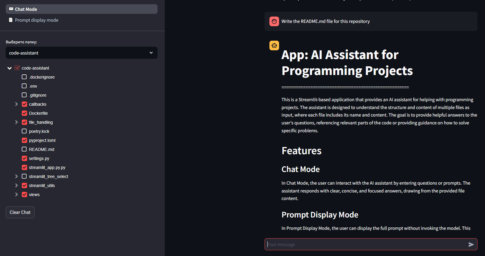

# App: AI Assistant for Programming Projects

This is a Streamlit-based application that provides an AI assistant for programming projects. The assistant is designed to understand the structure and content of multiple files, where each file includes its name and content. The goal is to provide helpful answers to the user's questions, referencing relevant parts of the code or offering guidance on solving specific problems.

## Getting Started

1. Clone the repository and navigate to the project directory:
    ```bash
    git clone https://github.com/SkurikhinVladimir/AI-Assistant-for-Programming-Projects.git
    cd AI-Assistant-for-Programming-Projects
    ```
2. Create a `.env` file in the project directory with your OpenAI API key and other settings. You can use [`.env.example`](./.env.example) as a reference. For a free access to the model, you can obtain an API key from [Groq's Console](https://console.groq.com/keys).
3. Build and run the application using Docker. Ensure Docker is installed, then use the following command:
    ```bash
    docker-compose up --build
    ```
   This will build the Docker image and start the application in a container. The application will be available at [localhost:8501](http://localhost:8501).

## Features

### Chat Mode

Interact with the AI assistant by entering questions or prompts. The assistant responds with clear, concise, and focused answers based on the provided file content.

### Prompt Display Mode

Display the full prompt without invoking the model. This mode allows users to review and edit the prompt before submitting it to the AI assistant.

## Usage

1. Select a project folder from the sidebar.
2. Choose between Chat Mode and Prompt Display Mode.
3. In Chat Mode, enter your question or prompt in the input field and receive a response based on the code and files in the selected project folder.
4. In Prompt Display Mode, view and edit the full prompt text before submitting it to ensure it meets your needs.




## Contributing

Contributions are welcome! If you'd like to contribute to this project, please submit a pull request with your changes.